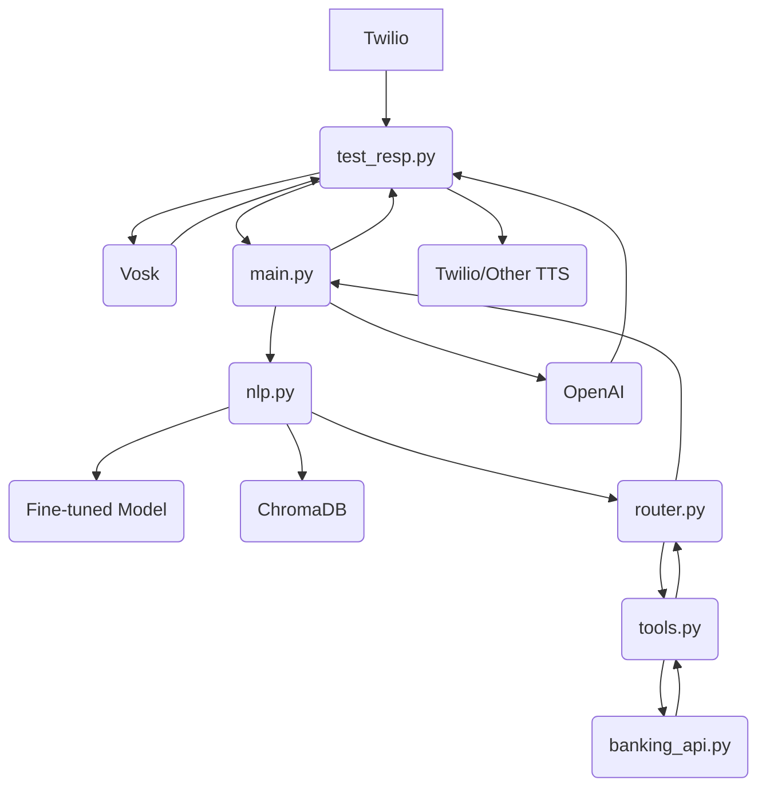

### Mermaid Flowchart (Simplified for Maximum Compatibility)

                                +------------------+     +------------------+     +--------------------------+
                                | Twilio (Call)    | --> | test_resp.py     | --> | Vosk (Speech-to-Text)    |
                                +------------------+     +------------------+     +--------------------------+
                                                                |                          |
                                                                | (Text)                   |
                                                                v                          |
                                                        +--------------------+            |
                                                        | test_resp.py       | <----------+
                                                        | (API Request)      |
                                                        +--------------------+
                                                                |
                                                                | (POST /predict_intent)
                                                                v
                                                        +--------------------+
                                                        | main.py (Flask)    |
                                                        | (Receive Query)    |
                                                        +--------------------+
                                                                |
                                                                | (Call process_user_query)
                                                                v
                                                        +--------------------+     +------------------+     +------------------+
                                                        | nlp.py             | --> | Fine-tuned Model |     | ChromaDB         |
                                                        | (Intent Classif.)  |     | (model.py)       |     | (Session Ctx)    |
                                                        +--------------------+     +------------------+     +------------------+
                                                                |
                                                                | (Intent, Confidence)
                                                                v
                                                        +--------------------+
                                                        | router.py          |
                                                        | (Route Request)    |
                                                        +--------------------+
                                                                |
                                                                | (Call Tool)
                                                                v
                                                        +--------------------+     +--------------------------+
                                                        | tools.py           | --> | banking_api.py           |
                                                        | (Tool Interface)   |     | (Banking Operations)     |
                                                        +--------------------+     +--------------------------+
                                                                |                          ^
                                                                | (API Call/Response)      |
                                                                v                          |
                                                        +--------------------+ <-----------+
                                                        | router.py          |
                                                        | (Process Result)   |
                                                        +--------------------+
                                                                |
                                                                | (Response)
                                                                v
                                                        +--------------------+     +------------------+     +--------------------------+
                                                        | main.py            | --> | test_resp.py     | --> | Twilio/Other TTS         |
                                                        | (Return Response)  |     | (Text-to-Speech) |     | (Play Back to Caller)    |
                                                        +--------------------+     +------------------+     +--------------------------+
                                                                ^
                                                                | (Low Confidence Fallback)
                                                                |
                                                        +------------------+
                                                        | OpenAI           |
                                                        | (Fallback Resp.) |
                                                        +------------------+
